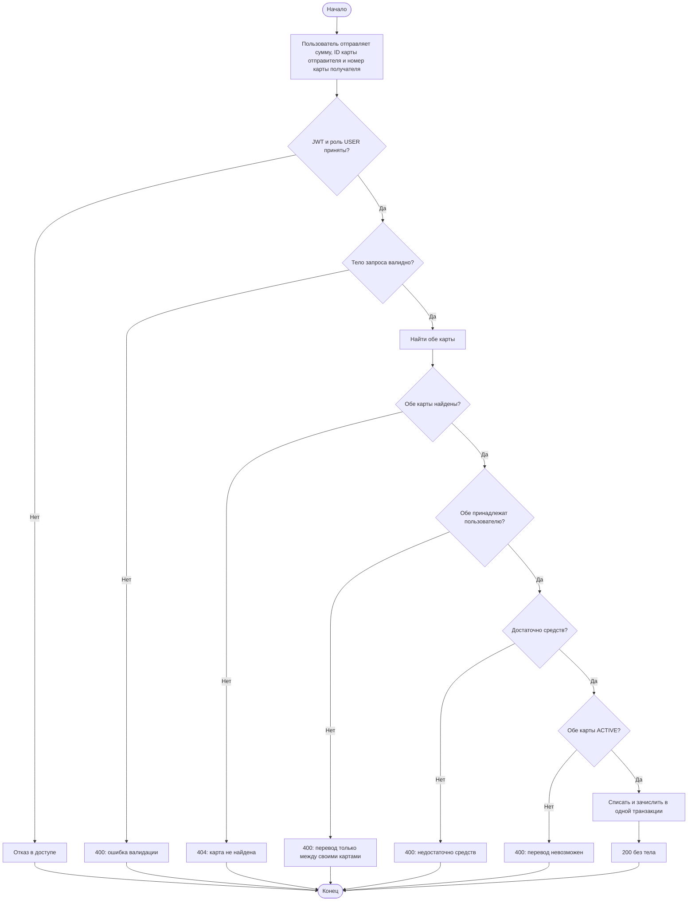
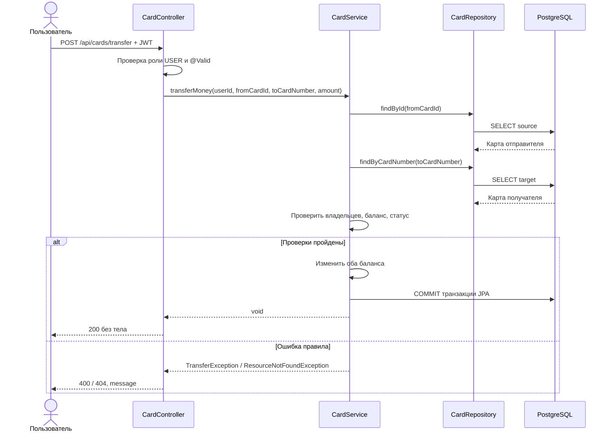

# Процесс и последовательность перевода

## Процесс в стиле BPMN

```mermaid
flowchart TD
    A([Начало]) --> B[Пользователь отправляет сумму, ID карты отправителя и номер карты получателя]
    B --> C{JWT и роль USER приняты?}
    C -- Нет --> X[Отказ в доступе]
    C -- Да --> D{Тело запроса валидно?}
    D -- Нет --> Y[400: ошибка валидации]
    D -- Да --> E[Найти обе карты]
    E --> F{Обе карты найдены?}
    F -- Нет --> Z[404: карта не найдена]
    F -- Да --> G{Обе принадлежат пользователю?}
    G -- Нет --> H[400: перевод только между своими картами]
    G -- Да --> I{Достаточно средств?}
    I -- Нет --> J[400: недостаточно средств]
    I -- Да --> K{Обе карты ACTIVE?}
    K -- Нет --> L[400: перевод невозможен]
    K -- Да --> M[Списать и зачислить в одной транзакции]
    M --> N[200 без тела]
    X --> O([Конец])
    Y --> O
    Z --> O
    H --> O
    J --> O
    L --> O
    N --> O
```

## UML sequence

```mermaid
sequenceDiagram
    actor User as Пользователь
    participant API as CardController
    participant Service as CardService
    participant Repo as CardRepository
    participant DB as PostgreSQL
    User->>API: POST /api/cards/transfer + JWT
    API->>API: Проверка роли USER и @Valid
    API->>Service: transferMoney(userId, fromCardId, toCardNumber, amount)
    Service->>Repo: findById(fromCardId)
    Repo->>DB: SELECT source
    DB-->>Repo: Карта отправителя
    Service->>Repo: findByCardNumber(toCardNumber)
    Repo->>DB: SELECT target
    DB-->>Repo: Карта получателя
    Service->>Service: Проверить владельцев, баланс, статус
    alt Проверки пройдены
        Service->>Service: Изменить оба баланса
        Service->>DB: COMMIT транзакции JPA
        Service-->>API: void
        API-->>User: 200 без тела
    else Ошибка правила
        Service-->>API: TransferException / ResourceNotFoundException
        API-->>User: 400 / 404, message
    end
```
